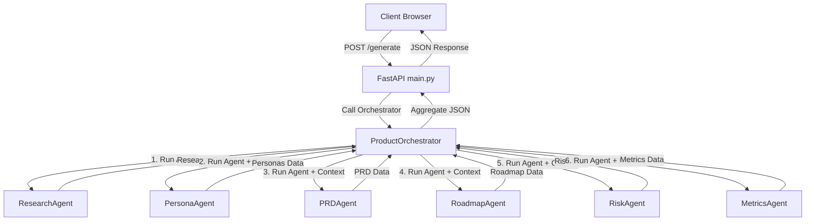

# Implementation Plan - Multi-Agent Backend with Google ADK

This plan updates the FastAPI backend to use a modular multi-agent system built on the **Google ADK (Antigravity SDK)**. Each stage of the product blueprint generation (Market Research, Personas, PRD, Roadmap, Risks, and Metrics) will be handled by a dedicated agent, coordinated sequentially by a central orchestrator.

---

## Architecture Overview

- **Framework**: FastAPI (handling client requests, static files, and CORS).
- **Agent Framework**: Google ADK (`google-adk`). We define 6 scoped agents with their own prompts and response schemas.
- **Orchestrator**: `product_orchestrator.py` manages execution sequence and context-passing (injecting outputs of previous steps as inputs to the next).
- **Graceful Fallback**: If `GEMINI_API_KEY` is not present, the orchestrator/agents fall back to the high-quality tailored mock generator, ensuring the application remains runnable without API access.

---

## Proposed Changes

### 1. Schema Definitions

#### [MODIFY] [response_schema.py](file:///Users/monish_ch/Desktop/Agentic%20AI/Kaggle%20Course/ProductForge%20AI/backend/schemas/response_schema.py)
We will add wrapper Pydantic models to represent structured outputs of each agent:
- `ResearchOutput`: Contains `market_research` and `competitors`.
- `PersonaOutput`: Contains `personas`.
- `PRDOutput`: Contains `prd`, `user_stories`, and `acceptance_criteria`.
- `RoadmapOutput`: Contains `roadmap`.
- `RiskOutput`: Contains `risks`.
- `MetricsOutput`: Contains `kpis`.

---

### 2. Prompt Templates

We will split the monolithic prompt into 6 modular prompt files under `backend/prompts/`:
* `[NEW]` [research_prompt.txt](file:///Users/monish_ch/Desktop/Agentic%20AI/Kaggle%20Course/ProductForge%20AI/backend/prompts/research_prompt.txt)
* `[NEW]` [persona_prompt.txt](file:///Users/monish_ch/Desktop/Agentic%20AI/Kaggle%20Course/ProductForge%20AI/backend/prompts/persona_prompt.txt)
* `[NEW]` [prd_prompt.txt](file:///Users/monish_ch/Desktop/Agentic%20AI/Kaggle%20Course/ProductForge%20AI/backend/prompts/prd_prompt.txt)
* `[NEW]` [roadmap_prompt.txt](file:///Users/monish_ch/Desktop/Agentic%20AI/Kaggle%20Course/ProductForge%20AI/backend/prompts/roadmap_prompt.txt)
* `[NEW]` [risk_prompt.txt](file:///Users/monish_ch/Desktop/Agentic%20AI/Kaggle%20Course/ProductForge%20AI/backend/prompts/risk_prompt.txt)
* `[NEW]` [metrics_prompt.txt](file:///Users/monish_ch/Desktop/Agentic%20AI/Kaggle%20Course/ProductForge%20AI/backend/prompts/metrics_prompt.txt)

---

### 3. Dedicated Agents

We will create the following agent modules under `backend/agents/`. Each module will expose an async function `run_agent(idea: str, context: dict = None, api_key: str = None)`. They will load prompts, run the Google ADK agent with structured output, and implement custom fallback mocks:
* `[NEW]` [research_agent.py](file:///Users/monish_ch/Desktop/Agentic%20AI/Kaggle%20Course/ProductForge%20AI/backend/agents/research_agent.py)
* `[NEW]` [persona_agent.py](file:///Users/monish_ch/Desktop/Agentic%20AI/Kaggle%20Course/ProductForge%20AI/backend/agents/persona_agent.py)
* `[NEW]` [prd_agent.py](file:///Users/monish_ch/Desktop/Agentic%20AI/Kaggle%20Course/ProductForge%20AI/backend/agents/prd_agent.py)
* `[NEW]` [roadmap_agent.py](file:///Users/monish_ch/Desktop/Agentic%20AI/Kaggle%20Course/ProductForge%20AI/backend/agents/roadmap_agent.py)
* `[NEW]` [risk_agent.py](file:///Users/monish_ch/Desktop/Agentic%20AI/Kaggle%20Course/ProductForge%20AI/backend/agents/risk_agent.py)
* `[NEW]` [metrics_agent.py](file:///Users/monish_ch/Desktop/Agentic%20AI/Kaggle%20Course/ProductForge%20AI/backend/agents/metrics_agent.py)

---

### 4. Orchestrator

#### [NEW] [product_orchestrator.py](file:///Users/monish_ch/Desktop/Agentic%20AI/Kaggle%20Course/ProductForge%20AI/backend/orchestrator/product_orchestrator.py)
- Sequence the agent runs: Research -> Persona -> PRD -> Roadmap -> Risk -> Metrics.
- Compile previous agent outputs into the `context` dictionary passed to subsequent agents.
- Aggregate all intermediate dictionaries into a complete `ProductPlanResponse` structure.

---

### 5. API Server Integration

#### [MODIFY] [main.py](file:///Users/monish_ch/Desktop/Agentic%20AI/Kaggle%20Course/ProductForge%20AI/backend/main.py)
- Import `product_orchestrator` instead of `gemini_service`.
- Redirect generation routes to `product_orchestrator.generate_plan`.

---

## Verification Plan

### Automated Tests
- Syntax check Python modules using `python -m py_compile`.
- Test generator API endpoints locally.

### Manual Verification
1. Start the server using `uvicorn main:app --app-dir backend --reload`.
2. Access `http://localhost:8000/docs` to verify the modified schema structure.
3. Submit a new idea through the UI dashboard (at `http://localhost:8000`) and ensure it populates all tabs without errors.
4. Verify fallback mock behavior by temporarily renaming the `GEMINI_API_KEY` in the environment or `.env` file.
