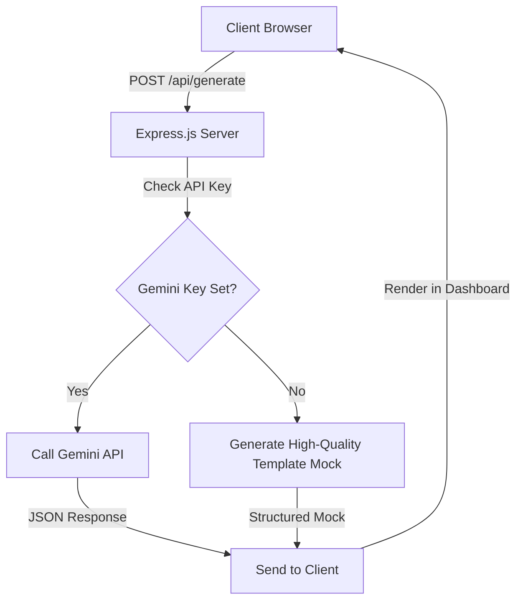

# Implementation Plan - ProductForge AI

ProductForge AI is a dashboard-driven web application that takes a product idea and automatically generates a comprehensive product strategy plan, including:
1. Market Research
2. User Personas
3. Product Requirements Document (PRD)
4. Product Roadmap
5. Key Performance Indicators (KPIs)

The app will feature a sleek, modern dashboard layout with rich aesthetics, real-time generation feedback, and interactive tabs to view the forged sections.

---

## Architecture Overview

- **Backend**: Node.js + Express.js. Simple, fast, and easy to run with a single command. It will expose a `/api/generate` endpoint, call the Google Gemini API (or fallback gracefully to an interactive mock if no key is supplied), and serve the frontend statically.
- **Frontend**: Single-page application using modern semantic HTML5, vanilla CSS3 (dark theme, glassmorphism, responsive grid), and client-side JavaScript. No framework overhead ensures ultra-fast page speed and simple code structure.

---

## User Review Required

> [!NOTE]
> We will implement a highly interactive experience where the generation progress is shown step-by-step (e.g., "Analyzing Market...", "Designing Personas...", etc.) to make the experience feel premium and alive.

> [!IMPORTANT]
> The application will run out-of-the-box. If you configure a `GEMINI_API_KEY` in a `.env` file (or in your environment), it will query the Gemini API to produce custom content. Otherwise, it will fallback to a rich mock generator that generates detailed, specific plans matching your product idea.

---

## Proposed Changes

### 1. Backend Layer (Server & Configuration)

#### [NEW] [package.json](file:///Users/monish_ch/Desktop/Agentic AI/Kaggle Course/ProductForge AI/package.json)
Configure npm project, scripts, and dependencies:
- `express` (routing & file serving)
- `dotenv` (environment variables)
- `cors` (if needed)

#### [NEW] [.env](file:///Users/monish_ch/Desktop/Agentic AI/Kaggle Course/ProductForge AI/.env)
Local configuration file for `PORT` and `GEMINI_API_KEY`.

#### [NEW] [server.js](file:///Users/monish_ch/Desktop/Agentic AI/Kaggle Course/ProductForge AI/server.js)
The core backend server that:
- Serves the static assets from the `public` directory.
- Exposes `POST /api/generate` to accept product ideas.
- Communicates with the Gemini API using native HTTP `fetch` to request a structured JSON schema.
- Handles mock fallback logic if no key is present.

---

### 2. Frontend Layer (Static Assets)

#### [NEW] [public/index.html](file:///Users/monish_ch/Desktop/Agentic AI/Kaggle Course/ProductForge AI/public/index.html)
Semantic HTML5 document featuring:
- Hero branding header.
- Main layout divided into:
  - **Left Panel**: Input text area for the product idea + settings.
  - **Right Panel (Dashboard)**: Output view with tabs/cards for Market Research, Personas, PRD, Roadmap, and KPIs.
- Interactive status overlays and placeholders.
- Copy/Export tools.

#### [NEW] [public/style.css](file:///Users/monish_ch/Desktop/Agentic AI/Kaggle Course/ProductForge AI/public/style.css)
Premium styles implementing:
- Sleek dark theme (`slate-900` backgrounds, custom neon accents).
- Outlined inputs with active glow effects.
- Glassmorphism overlays (`backdrop-filter: blur()`).
- Modern transitions for tabs and loading bars.
- Responsive design via container queries and Flexbox/Grid layouts.

#### [NEW] [public/app.js](file:///Users/monish_ch/Desktop/Agentic AI/Kaggle Course/ProductForge AI/public/app.js)
State management and interactivity:
- Input forms and click events.
- Progressive status tracking during generation.
- Request payload management to the backend.
- Markdown rendering (using `marked` via CDN for clean styling of bullet points and tables).
- Copy-to-clipboard functionality.

---

## Verification Plan

### Automated Tests
- Run `npm run lint` or quick node syntax checks on server.js.

### Manual Verification
1. Start the server using `npm start` (or `node server.js`).
2. Open the web app at `http://localhost:3000`.
3. Verify that the dashboard displays empty states or instruction alerts initially.
4. Input a sample product idea (e.g., "A subscription-based SaaS for pet health tracking").
5. Click **Generate Plan** and verify the progressive status indicators.
6. Verify that the tabs (Market Research, Personas, PRD, Roadmap, KPIs) populate with detailed, formatted text once complete.
7. Click the "Copy section" or "Export" buttons to verify clipboard tools.
8. Add a mock `GEMINI_API_KEY` to `.env` to verify the external API call pathway.
