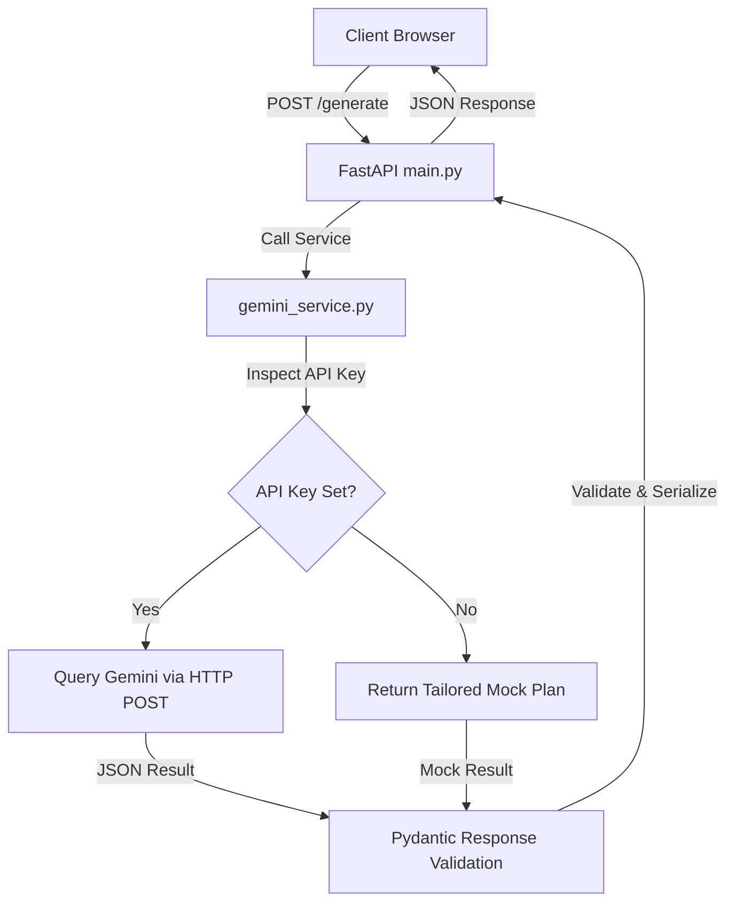

# Implementation Plan - FastAPI Backend for ProductForge AI

We will implement a Python-based **FastAPI** backend to serve as an alternative or replacement for the Express.js server. This backend will conform to the exact folder structure requested, utilizing **Pydantic** for schemas, and **python-dotenv** for configuration.

---

## Architecture Overview



- **Framework**: FastAPI (runs asynchronously via `uvicorn`).
- **Data Validation**: Pydantic models for both incoming requests (`ProductIdea`) and outgoing responses (`ProductPlan`).
- **Service Layer**: `gemini_service.py` encapsulates the logic for talking to the Gemini API (using `httpx` for asynchronous HTTP requests) and falls back to a high-quality mock generator if `GEMINI_API_KEY` is not configured.
- **Frontend Integration**: FastAPI will serve static files from the `public/` folder at the root, maintaining compatibility with our existing dashboard.

---

## Proposed Changes

We will create the `backend/` directory and build the following files:

### 1. Model & Schema Definitions

#### [NEW] [product_idea.py](file:///Users/monish_ch/Desktop/Agentic%20AI/Kaggle%20Course/ProductForge%20AI/backend/models/product_idea.py)
Pydantic model representing the incoming request body:
```python
from pydantic import BaseModel, Field

class ProductIdea(BaseModel):
    idea: str = Field(..., min_length=1, description="The core product idea or concept to analyze")
```

#### [NEW] [response_schema.py](file:///Users/monish_ch/Desktop/Agentic%20AI/Kaggle%20Course/ProductForge%20AI/backend/schemas/response_schema.py)
Pydantic model representing the generated product strategy plan:
```python
from pydantic import BaseModel

class ProductPlan(BaseModel):
    marketResearch: str
    personas: str
    prd: str
    roadmap: str
    kpis: str
```

---

### 2. Service Layer

#### [NEW] [gemini_service.py](file:///Users/monish_ch/Desktop/Agentic%20AI/Kaggle%20Course/ProductForge%20AI/backend/services/gemini_service.py)
Encapsulates all generative capabilities:
- Check environment variables for `GEMINI_API_KEY`.
- Perform async HTTP POST requests to Gemini API using `httpx`.
- Implement a local, high-quality, customized mock generator if no key is configured.

---

### 3. Application Entrypoint & Setup

#### [NEW] [main.py](file:///Users/monish_ch/Desktop/Agentic%20AI/Kaggle%20Course/ProductForge%20AI/backend/main.py)
- Initialize FastAPI app.
- Wire up configuration settings using `python-dotenv`.
- Expose `POST /generate` endpoint accepting `ProductIdea` and returning `ProductPlan`.
- Enable CORS middleware for local development.
- Mount the root `public/` folder to serve the static dashboard page.

#### [NEW] [.env](file:///Users/monish_ch/Desktop/Agentic%20AI/Kaggle%20Course/ProductForge%20AI/backend/.env)
Local configuration file for Python runtime, specifying `PORT=8000` and `GEMINI_API_KEY`.

---

## Verification Plan

### Automated Verification
- Verify code syntax using python compilation tests.
- Set up a virtual environment and install packages (`fastapi`, `uvicorn`, `pydantic`, `python-dotenv`, `httpx`).

### Manual Verification
1. Start the FastAPI server using `uvicorn main:app --host 127.0.0.1 --port 8000 --reload` from the `backend/` directory.
2. Visit `http://localhost:8000` in the browser and verify the dashboard loads.
3. Submit a product idea (e.g. "A pet wellness app") and verify that it fetches and parses the results correctly.
4. Verify tab navigation and exporting features continue to work seamlessly.
5. Access automatic documentation at `http://localhost:8000/docs`.
